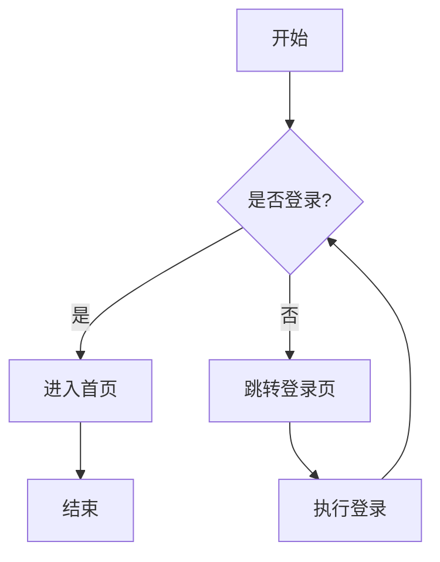
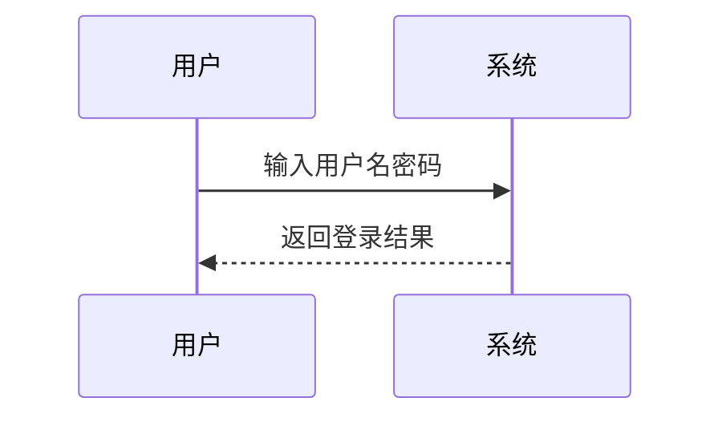
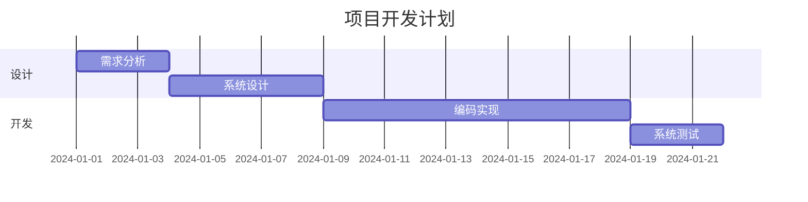

# 我的Markdown笔记

## Mermaid的使用示例

### 流程图制作

可以用于制作思维导图，流程图等。在制作构成的友好度上高于LaTeX。

节点形状：[矩形]（圆角矩形）{菱形} ((圆形))

连线形状：-->实线箭头、---实线、-.->虚线箭头、==>粗实线箭头、--文本-->在线上添加文字。

### 时序图制作

箭头类型：->> 实线（同步请求），-->> 虚线（异步响应），Note over A,B: 添加备注

### 甘特图 (Gantt Diagram)

## 表格部分

| 理论频率$f_1$ | 实际频率$f_2$ |
|:-----------:|:------------:|
|12.35        |13.02         |
|11.54        |12.89         |
|20.67        |21.24          |

