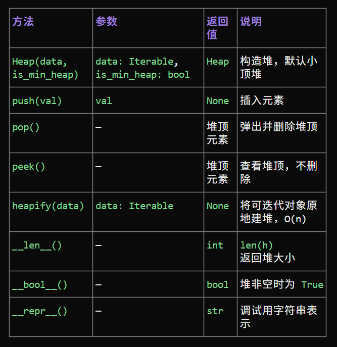
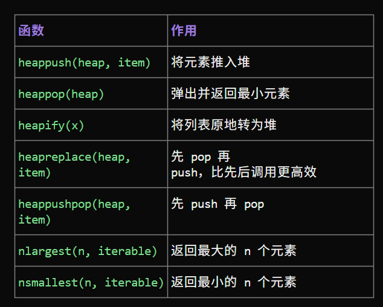

# 堆积如山

**堆（heap）结构**，特殊的树
- 小顶堆（min heap）：任意节点的值**小于等于**其子节点的值。
- 大顶堆（max heap）：任意节点的值**大于等于**其子节点的值。

堆作为完全二叉树的一个特例，具有以下特性。
- 最底层节点靠左填充，其他层的节点都被填满
- 我们将二叉树的根节点称为“堆顶”，将**底层最靠右的节点称为“堆底”。**
- 对于大顶堆（小顶堆），堆顶元素（根节点）的值是最大（最小）的。

需要指出的是，许多编程语言提供的是优先队列（priority queue），这是一种抽象的数据结构，定义为具有优先级排序的队列。

实际上，堆通常用于实现优先队列，大顶堆相当于元素按从大到小的顺序出队的优先队列。**从使用角度来看，我们可以将“优先队列”和“堆”看作等价的数据结构。**因此，本书对两者不做特别区分，统一称作“堆”。

堆的常用操作见下表，方法名需要根据编程语言来确定。

|方法|描述|时间复杂度|
|---|---|---|
|`push()`|元素入堆|$O(log n)$|
|`pop()`|堆顶元素出堆|$O(log n)$|
|`peak()`|输出堆顶的元素|$O(1)|
|`size()`|输出堆的大小，元素个数|$O(1)$|
|`isEmpty()`|判断是否为空|$O(1)$|

## 堆的实现

### 堆的存储与表示

用数组表示一颗完全二叉树，索引为$i$，左子节点$2i+1$，右子节点$2i+2$，父节点$\frac{i - 1}{2}$。

堆的常见操作：
- 堆排序
- 优先队列
- 最大k个元素

堆的实现关键就在于下沉与上浮操作，这两个操作要依托前面的一系列准备方法来实现。



```python

class Heap:
    def __init__(self, data=None, is_min_heap=True):
        self._heap = []
        self._is_min = is_min_heap
        if data:
            self.heapify(data)

    def _compare(self, child, parent):
        if self._is_min:
            return child < parent
        return child > parent

    def _swap(self, i, j):
        self._heap[i], self._heap[j] = self._heap[j], self._heap[i]

    def _sift_up(self, idx):
        while idx > 0:
            parent = (idx - 1) // 2
            if self._compare(self._heap[idx], self._heap[parent]):
                self._swap(idx, parent)
                idx = parent
            else:
                break

    def _sift_down(self, idx):
        size = len(self._heap)
        while True:
            extreme = idx
            left = 2 * idx + 1
            right = 2 * idx + 2
            if left < size and self._compare(self._heap[left], self._heap[extreme]):
                extreme = left
            if right < size and self._compare(self._heap[right], self._heap[extreme]):
                extreme = right
            if extreme != idx:
                self._swap(idx, extreme)
                idx = extreme
            else:
                break

    def push(self, val):
        self._heap.append(val)
        self._sift_up(len(self._heap) - 1)

    def pop(self):
        if not self._heap:
            raise IndexError("pop from empty heap")
        self._swap(0, len(self._heap) - 1)
        val = self._heap.pop()
        self._sift_down(0)
        return val

    def peek(self):
        if not self._heap:
            raise IndexError("peek at empty heap")
        return self._heap[0]

    def heapify(self, data):
        self._heap = list(data)
        for i in range(len(self._heap) // 2 - 1, -1, -1):
            self._sift_down(i)

    def __len__(self):
        return len(self._heap)

    def __bool__(self):
        return bool(self._heap)

    def __repr__(self):
        return f"Heap({self._heap}, is_min_heap={self._is_min})"
    

```

但是对于python程序，在实战时不必如此复杂，因为`python`中自带了关于堆的实现的操作：`heapq`模块


