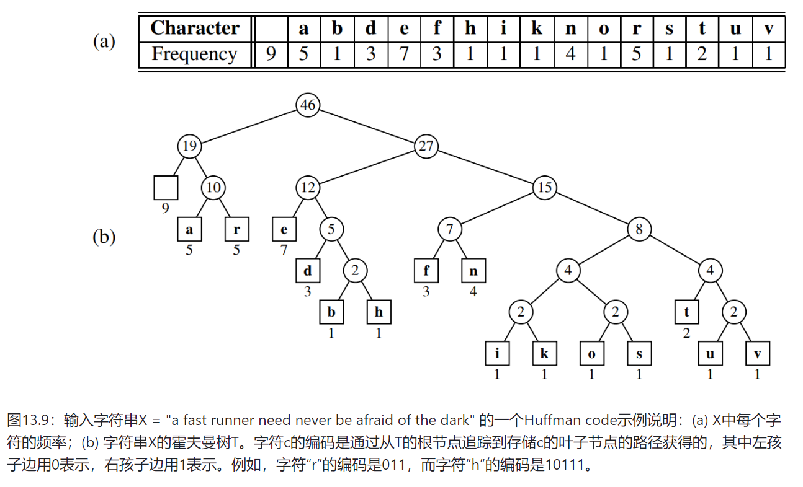

# 霍夫曼编码

文本处理任务：文本压缩。在这个问题中，我们得到一个在某些字母表（如ASCII字符集）上定义的字符串X，并希望将其高效地编码为一个较小的二进制字符串Y（仅使用0和1字符）。文本压缩在任何希望减少数字通信带宽的情况下都非常有用，以便最小化传输文本所需的时间。同样，文本压缩对于更高效地存储大型文档也很有用，从而允许固定容量的存储设备包含尽可能多的文档。

## 原理

*霍夫曼编码是一种无损数据压缩算法，通过为字符分配可变长度码字来实现压缩：出现频率越高的字符分配越短的码字，频率越低的分配越长的码字。它构建一棵最优二叉树（霍夫曼树），确保前缀码性质（任意码字不是另一个码字的前缀），从而可以无歧义地解码。*

本节探讨的文本压缩方法是**Huffman code**。像ASCII这样的标准编码方案使用固定长度的二进制字符串来编码字符（在传统的或扩展的ASCII系统中分别为7位或8位）。**Huffman code通过使用较短的码字code-word 字符串编码高频字符和较长的码字字符串编码低频字符来节省空间。**此外，Huffman code使用专门针对给定字母表上的任何字符串X优化的可变长度编码variable-length encoding。这种优化基于**字符频率**的使用，对于每个字符c，其在字符串X中出现次数的计数为 f(c)。

为了编码字符串X，将其中的每个字符转换为可变长度的码字，并按顺序连接所有这些码字以生成X的编码Y。为了避免歧义，<mark>在编码中没有任何码字是另一个码字的前缀。这样的编码被称为前缀编码prefix code，它简化了将Y解码回X的过程。<mark>（参见图13.9。）即使有这个限制，使用可变长度前缀码所能达到的节省也是非常显著的，特别是如果字符频率存在较大的差异时（几乎每种书面语言的自然语言文本都是这种情况）。

用于为X生成最优可变长度前缀码的 **Huffman’s algorithm** 基于构造表示该代码的二叉树T。T中的每条边代表码字中的一位，到左孩子的边代表“0”，到右孩子的边代表“1”。每个叶子v与特定字符关联，<mark>该字符的码字由从T的根到v路径上的边所关联的比特序列定义。<mark>, **每个叶子v都有一个频率f(v)，即与v关联的字符在X中的频率。此外，我们给T中的每个内部节点v赋予一个频率f(v)，它是以v为根的子树中所有叶子的频率之和。**



## 霍夫曼算法(贪心法)

霍夫曼编码算法从字符串X中每个独特的d个字符开始，每个字符都是单节点二叉树的根节点。算法以一系列的轮次进行。<mark>在每一轮中，算法将具有最小频率的两棵二叉树合并为一棵二叉树。此过程重复进行，直到只剩下一棵树为止。<mark>

**命题（Proposition）**：霍夫曼算法在 $O(n+d logd)$ 时间内为长度为n且包含d个不同字符的字符串构造了一个最优前缀码（optimal prefix code）。

python实现：

```python

import heapq

class Node:
    def __init__(self, weight, char=None):
        self.weight = weight
        self.char = char
        self.left = None
        self.right = None

    def __lt__(self, other): 
        '''
        实现比较<，因为使用优先队列实现最小堆，其中节点之间涉及到比较问题！
        巧妙的重新定义定义系统方法，使得heapq可以用于对象
        '''
        if self.weight == other.weight:
            return self.char < other.char
        return self.weight < other.weight

def huffman_encoding(char_freq: dict):
    heap = [Node(freq, char) for char, freq in char_freq.items()]
    heapq.heapify(heap)

    while len(heap) > 1:
        left = heapq.heappop(heap)
        right = heapq.heappop(heap)
        merged = Node(left.weight + right.weight, min(left.char, right.char))
        merged.left = left
        merged.right = right

    return heap[0]

def external_path_length(node, depth = 0):
    if node is None:
        return 0
    if node.left is None and node.right is None:
        return depth * node.weight
    return external_path_length(node.left, depth + 1) + external_path_length(node.right, depth + 1)
```

这段代码首先定义了一个`Node`类来表示哈夫曼树的节点。然后，使用最小堆来构建哈夫曼树，每次从堆中取出两个频率最小的节点进行合并，直到堆中只剩下一个节点，即哈夫曼树的根节点。接着，使用递归方法计算哈夫曼树的带权外部路径长度（weighted external path length）。最后，输出计算得到的带权外部路径长度（也就是编码的总字符数）。

## 典型例题

小张要将一根长度为L的绳子剪成N段。准备剪的绳子的长度为L1,L2,L3...,LN，未剪的绳子长度恰好为剪后所有绳子长度的和。
每次剪断绳子时，需要的开销是此段绳子的长度。
比如，长度为10的绳子要剪成长度为2,3,5的三段绳子。长度为10的绳子切成5和5的两段绳子时，开销为10。再将5切成长度为2和3的绳子，开销为5。因此总开销为15。
请按照目标要求将绳子剪完最小的开销时多少。

已知，1<=N <= 20000，0<=Li<= 50000

输入: 第一行：N，将绳子剪成的段数。 第二行：准备剪成的各段绳子的长度。

输出: 最小开销

