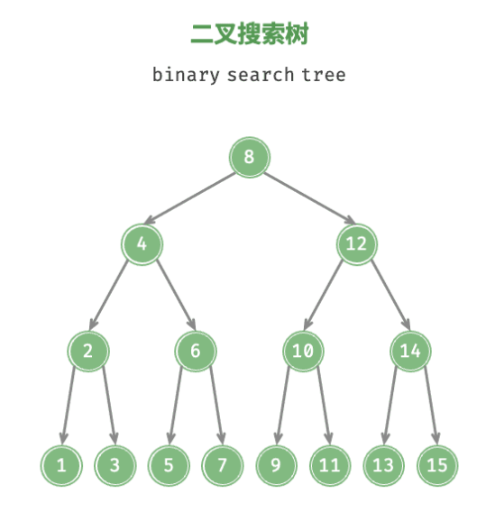
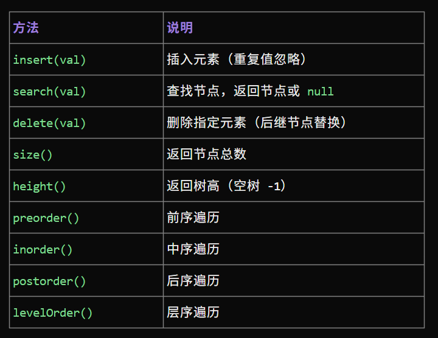

# 二叉搜索

## 二叉搜索树引入

1. 对于根节点，左子树中所有节点的值 < 根节点的值 < 右子树中所有节点的值。
2. 任意节点的左、右子树也是二叉搜索树，即同样满足条件 1。



## 二叉树的操作

我们将二叉搜索树封装为一个类 `BinarySearchTree` ，并声明一个成员变量 `root` ，指向树的根节点。

- *查找节点*：给定目标节点值 num ，可以根据二叉搜索树的性质来查找。如下图所示，我们声明一个节点 cur ，从二叉树的根节点 root 出发，循环比较节点值 cur.val 和 num 之间的大小关系。

  1. 若 cur.val < num ，说明目标节点在 cur 的右子树中，因此执行 cur = cur.right 。
  2. 若 cur.val > num ，说明目标节点在 cur 的左子树中，因此执行 cur = cur.left 。
  3. 若 cur.val = num ，说明找到目标节点，跳出循环并返回该节点。

- *插入节点*给定一个待插入元素 num ，为了保持二叉搜索树“左子树 < 根节点 < 右子树”的性质，插入操作流程如下图所示。

  1. 查找插入位置：与查找操作相似，从根节点出发，根据当前节点值和 num 的大小关系循环向下搜索，直到越过叶节点（遍历至 None ）时跳出循环。
  2. 在该位置插入节点：初始化节点 num ，将该节点置于 None 的位置。

- *删除节点*：先在二叉树中查找到目标节点，再将其删除。与插入节点类似，我们需要保证在删除操作完成后，二叉搜索树的“左子树 < 根节点 < 右子树”的性质仍然满足。因此，我们根据目标节点的子节点数量，分 0、1 和 2 三种情况，执行对应的删除节点操作。

  1. 当待删除节点的度为 0 时，表示该节点是叶节点，可以直接删除。
  2. 当待删除节点的度为 1 时，将待删除节点替换为其子节点即可。
  3. 当待删除节点的度为 2 时，我们无法直接删除它，而需要使用一个节点替换该节点。由于要保持二叉搜索树“左子树 
  < 根节点 < 右子树”的性质，因此这个节点可以是右子树的最小节点或左子树的最大节点。假设我们选择右子树的最小节点（中序遍历的下一个节点），则删除操作流程如下图所示。**找到待删除节点在“中序遍历序列”中的下一个节点，记为 tmp 。用 tmp 的值覆盖待删除节点的值，并在树中递归删除节点 tmp。**

- 中序遍历有序（二叉搜索树的中序遍历是升序的）

### python 代码实现


```python

class TreeNode:
    def __init__(self, val):
        self.val = val
        self.left = None
        self.right = None

class BinarySearchTree:
    def __init__(self):
        self.root = None

    def _size(self, node):
        return 0 if not node else 1 + self.size(node.left) + self.size(node.right)

    def size(self):
        return self._size(self.root)

    def _hight(self, node):
        return -1 if not node else 1 + max(self._hight(node.left) + self._hight(node.right))

    def hight(self):
        return self._hight(self.root)

    def insert(self, val):
        if not self.root:
            self.root = TreeNode(val)
            return
        cur = self.root
        while True:
            if cur.val > val:
                if not cur.left:
                    cur.left = TreeNode(val)
                    return
                cur = cur.left
            elif cur.val < val:
                if not cur.right:
                    cur.right = TreeNode(val)
                    return
                cur = cur.right
            else:
                return
    
    def search(self, val):
        cur = self.root
        while cur:
            if cur.val == val:
                return cur
            cur = cur.left if val < cur.val else cur.right
        retrun None

    def _min_node(self, node):
        while node.left:
            node = node.left
        return node
    # 表示在node的子树下删除元素val，返回删除节点以后，子树的根节点
    def _delete(self, node, val):
        if not node:
            return None
        if val < node.val:
            node.left = self._delete(node.left, val)
        elif val > node.val:
            node.right = self._delete(node.right, val)
        else:
            


```
## 二叉搜索树的效率

|操作|无序数组|二叉搜索树|
|---|---|---|
|查找| $O(n)$ | $O(logn)$ |
|插入| $O(1)$ | $O(logn)$ |
|删除| $O(n)$ | $O(logn)$ |

## 二叉搜索树的应用

- 用作系统中的多级索引，实现高效的查找、插入、删除操作。
- 作为某些搜索算法的底层数据结构。
- 用于存储数据流，以保持其有序状态。

### 二叉搜索树实现快排

可以使用二叉搜索树来实现快速排序的过程。具体步骤如下：

- 选择数组中的一个元素作为基准。创建一个空的二叉搜索树。
- 将数组中的其他元素逐个插入二叉搜索树中。
- 按照二叉搜索树的中序遍历（左子树、根节点、右子树）得到排序后的结果。

这种方法的时间复杂度为 $O(n log n)$，其中 n 是数组的长度。每次插入操作都需要 $O(log n)$ 的时间复杂度，总共进行 $n-1$ 次插入操作。

需要注意的是，二叉搜索树的性能取决于树的平衡性。如果二叉搜索树变得不平衡，性能可能会下降到 $O(n^2)$ 的时间复杂度。因此，在实际应用中，为了确保性能，通常会使用平衡二叉搜索树（如红黑树、AVL树）来实现快速排序。

## 例题

 *1. 给出一棵二叉搜索树的前序遍历，求它的后序遍历*

排序得到中序，问题拆分成：前序中序构建树，输出后序表达式

 *2. 输入：只有一行，包含若干个数字，中间用空格隔开。（数字可能会有重复，对于重复的数字，只计入一个）输出：输出一行，对输入数字建立二叉搜索树后进行按层次周游的结果。*

很简单，问题拆分为：顺序读入建树，然后广度优先搜索输出


