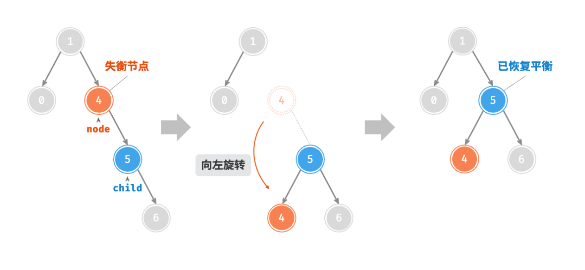
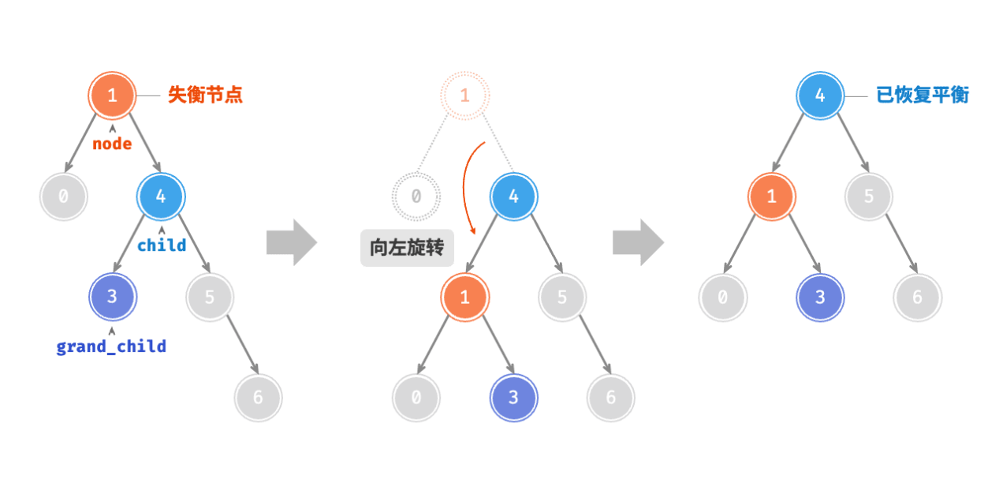
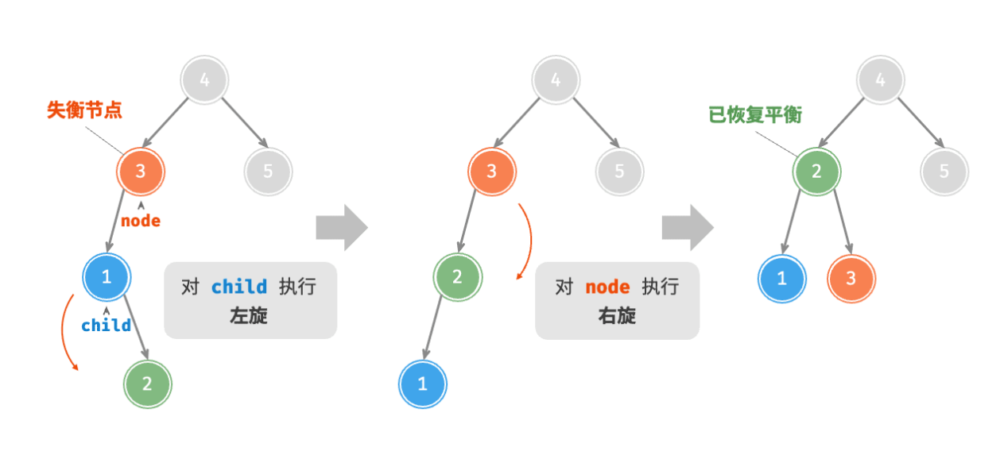
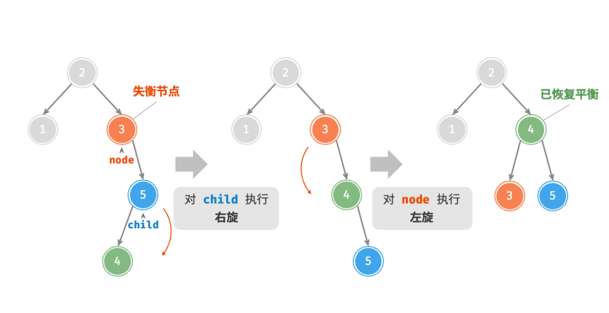

# 循序渐进

## *本文最最重要的是代码，*`AVLNode`*与*`AVLTree`*类*

二叉树在使用过程中可能出现退化的情况，这会造成二叉树的二分的效果无法发挥出来，实际运行效率会直接退化成 $O(n)$，这是我们所不想看到的。提出了 AVL 树。论文中详细描述了一系列操作，确保在持续添加和删除节点后，AVL 树不会退化，从而使得各种操作的时间复杂度保持在 $O(log\,n)$
 级别。换句话说，在需要频繁进行增删查改操作的场景中，AVL 树能始终保持高效的数据操作性能，具有很好的应用价值。

## AVL树介绍

AVL 树既是二叉搜索树，也是平衡二叉树，同时满足这两类二叉树的所有性质，因此是一种**平衡二叉搜索树（balanced binary search tree）。**

### 术语

- <mark>节点高度<mark>>：“节点高度”是指从该节点到它的最远叶节点的距离，即所经过的“边”的数量。需要特别注意的是，叶节点的高度为 0，而空节点的高度为 −1。

- <mark>节点平衡因子<mark>节点的平衡因子（balance factor）定义为节点左子树的高度减去右子树的高度，同时规定空节点的平衡因子为 0。

### AVL 树的旋转

AVL 树的特点在于“旋转”操作，它能够在不影响二叉树的中序遍历序列的前提下，使失衡节点重新恢复平衡。换句话说，旋转操作既能保持“二叉搜索树”的性质，也能使树重新变为“平衡二叉树”。

我们将平衡因子绝对值 > 1的节点称为“失衡节点”。根据节点失衡情况的不同，旋转操作分为四种：<mark>右旋、左旋、先右旋后左旋、先左旋后右旋。<mark>下面详细介绍这些旋转操作。

1. 右旋：如下图所示，节点下方为平衡因子。从底至顶看，二叉树中首个失衡节点是“节点 3”。我们关注以该失衡节点为根节点的子树，将该节点记为 node ，其左子节点记为 child ，执行“右旋”操作。完成右旋后，子树恢复平衡，并且仍然保持二叉搜索树的性质。如下图所示，当节点 child 有右子节点（记为 grand_child ）时，需要在右旋中添加一步：将 grand_child 作为 node 的左子节点。

2. 左旋：操作与右旋正好相反，镜面对称即可。因此，基于对称性，我们只需将右旋的实现代码中的所有的 left 替换为 right ，将所有的 right 替换为 left ，即可得到左旋的代码





3. 先左旋后右旋：对于下图中的失衡节点 3 ，仅使用左旋或右旋都无法使子树恢复平衡。此时需要先对 child 执行“左旋”，再对 node 执行“右旋”。



4. 先右旋再左旋：如下图所示，对于上述失衡二叉树的镜像情况，需要先对 child 执行“右旋”，再对 node 执行“左旋”。




## python构建

```python
from collections import deque

class AVLNode:
    def __init__(self, val):
        self.val = val
        self.left = None
        self.right = None
        self.height = 1

class AVLTree:
    def __init__(self):
        self.root = None

    def _height(self, node):
        return 0 if node is None else node.height

    def height(self):
        return self._height(self.root)

    def _bf(self, node):
        return self._bf(node.left) - self._bf(node.right)

    def _update_height(self, node): # 因为建树的时候，AVL树已经建好，但是AVLNode可能没有更新
        node.height = 1 + max(self._height(node.left), self._height(node.right))

    def _rotate_right(self, y): # 因为旋转完要和正常的父节点连接，所以要返回修正以后的失调修正根节点
        x = y.left
        T2 = x.right
        x.right = y
        y.left = T2
        self._update_height(y)
        self._update_height(x)
        return x

    def _rotate_left(self, y):
        x = y.right
        T2 = x.left
        x.left = y
        y.right = T2
        self._update_height(y)

    def rebalance(self, node):
        self._update_height(node)
        bf = self._bf(self, node)
        if bf > 1:
            if self._bf(node.left) < 0:
                node.left = self._rotate_left(node.left) # 先左旋后右旋
            return self._rotate_right(node)
        elif bf < -1:
            if self._bf(node.right) > 0:
                node.right = self._rotate_right(node.right) # 先右旋后左旋
            return self._rotate_left(node)
    
    def _insert(self, node, val):
        if not node:
            return AVLNode(val)
        elif val < node.val:
            node.left = self._insert(node.left, val)
        elif val > node.val:
            node.right = self._insert(node.right, val)
        else:
            return node # 插入已有元素时，不需要重排
        return self._rebalance(node) # 在子树上插入元素时，相当于逐级重排，确保树的平衡性

    def insert(self, val):
        self.root = self._insert(self.root, val)

    def search(self, val):
        current = self.root
        while current:
            if current.val == val:
                return current
            current = current.left if val < current.left else current.right
        return None

    def _min_node(self, node):
        while node.left:
            node = node.left
        return node

    def _delete(self, node, val): # 先查找，然后替换（与二叉搜索树是一样的），但是多一步再平衡
        if not node:
            return None
        elif node.val > val:
            node.left = self._delete(node.left, val)
        elif node.val < val:
            node.right = self._delete(node.right, val)
        else:
            if (not node.left) and (not node.right):
                return None
            elif (not node.left) or (not node.right):
                return node.right if not node.left else node.left
            else:
                succ = self._min_node(self, node)
                node.val = succ.val
                node.right = self._delete(node.right, succ.val)
        return node._rebalance(node)

    def delete(self, val):
        self.root = self._delete(self.root, val)

    def _size(self, node):
        if not node:
            return 0
        return 1 + self._size(node.left) + self._size(node.right)
    
    def size(self):
        return self._size(self.root)
    
    def _order(self, node, res, mode="pre"):
        if not node:
            return 
        if mode == "pre":
            res.append(self.root.val)
        self._order(node.left, res, mode)
        if mode == "mid":
            res.append(self.root.val)
        self.order(node.right, res, mode)
        if mode == "post":
            res.append(self.root)

    def order(self, mode):
        res = list()
        self._order(self.root, res, mode)
        return res

    def level_order(self):
        queue = deque([self.root])
        res = list()
        while queue:
            node = queue.popleft()
            if node.left is not None:
                queue.append(node.left)
            if node.right is not None:
                queue.append(node.right)
            res.append(node.val)
        return res

```
## AVL 树典型应用

- 组织和存储大型数据，适用于高频查找、低频增删的场景。
- 用于构建数据库中的索引系统。
- 红黑树也是一种常见的平衡二叉搜索树。相较于 AVL 树，红黑树的平衡条件更宽松，插入与删除节点所需的旋转操作更少，节点增删操作的平均效率更高。


    


        
    
                
    