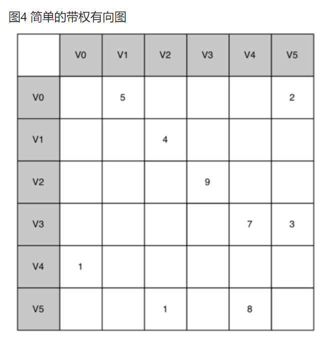
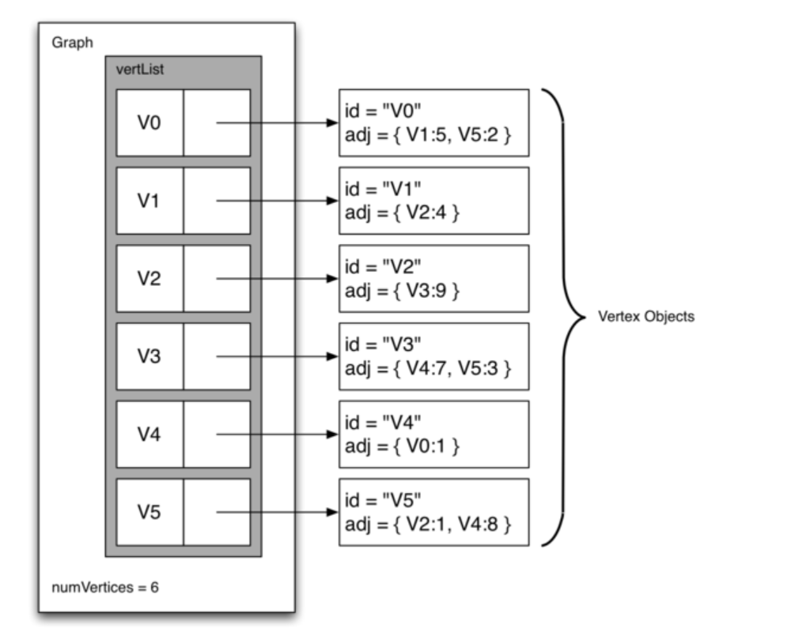

# 星罗棋布

<mark> 常见的图相关编程题目包括**广度优先搜索、深度优先搜索、拓扑排序、最短路径算法（如Dijkstra算法和Floyd-Warshall算法）、最小生成树算法（如Prim算法和Kruskal算法）**等。 <mark>

<mark>图论是数学的一个分支，主要研究图的性质以及图之间的关系。<mark>在与数据结构和算法相关的内容中，图论涵盖了以下几个方面：

- **图的表示**：图可以用不同的数据结构来表示，包括邻接矩阵、邻接表、关联矩阵等。这些表示方法影响着对图进行操作和算法实现的效率。
- **图的遍历**：图的遍历是指从图中的某个顶点出发，访问图中所有顶点且不重复的过程。常见的图遍历算法包括深度优先搜索（DFS）和广度优先搜索（BFS）。
- **最短路径**：最短路径算法用于找出两个顶点之间的最短路径，例如 Dijkstra 算法和 Floyd-Warshall 算法。这些算法在网络路由、路径规划等领域有广泛的应用。
- **最小生成树**：最小生成树算法用于在一个连通加权图中找出一个权值最小的生成树，常见的算法包括 Prim 算法和 Kruskal 算法。最小生成树在网络设计、电力传输等领域有着重要的应用。
- **拓扑排序**：拓扑排序算法用于对有向无环图进行排序，使得所有的顶点按照一定的顺序排列，并且保证图中的边的方向符合顺序关系。拓扑排序在任务调度、依赖关系分析等领域有重要的应用。
- **图的连通性**：图的连通性算法用于判断图中的顶点是否连通，以及找出图中的连通分量。这对于网络分析、社交网络分析等具有重要意义。

## 基本概念

一般来说，图可分为**有向图和无向图**。有向图的所有边都有方向，即确定了顶点到顶点的一个指向；而无向图的所有边都是双向的，即无向边所连接的两个顶点可以互相到达。在一些问题中，可以把无向图当作所有边都是正向和负向的两条有向边组成，这对解决一些问题很有帮助。

- 顶点Vertex：顶点又称节点，是图的基础部分。它可以有自己的名字，称作“键”。顶点也可以带有附加信息，称作“有效载荷”。

- 边Edge：边是图的另一个基础部分。两个顶点通过一条边相连，表示它们之间存在关系。边既可以是单向的，也可以是双向的。如果图中的所有边都是单向的，称之为有向图。图1明显是一个有向图，因为必须修完某些课程后才能修后续的课程。

- 度Degree：顶点的度是指和该顶点相连的边的条数。特别是对于有向图来说，顶点的出边条数称为该顶点的出度，顶点的入边条数称为该顶点的入度。

- 权值Weight：顶点和边都可以有一定属性，而量化的属性称为权值，顶点的权值和边的权值分别称为点权和边权。权值可以根据问题的实际背景设定，例如点权可以是城市中资源的数目，边权可以是两个城市之间来往所需要的时间、花费或距离。

有了上述定义之后，再来正式地定义图Graph。图可以用 $G$ 来表示，并且 $G = (V, E)$。其中，V是一个顶点集合，E是一个边集合。每一条边是一个二元组 $(v, w)$，其中w, v∈V。可以向边的二元组中再添加一个元素，用于表示权重。子图s是一个由边e和顶点v构成的集合，其中e⊂E且v⊂V。

- 路径Path 路径是由边连接的顶点组成的序列。路径的正式定义为$w_1, w_2, ···, w_n$，其中对于所有的 $1≤i≤n-1$，有$(w_i, w_{i+1})∈E$。无权重路径的长度是路径上的边数，有权重路径的长度是路径上的边的权重之和。

- 环Cycle 环是有向图中的一条起点和终点为同一个顶点的路径。没有环的图被称为无环图，没有环的有向图被称为 <makr>有向无环图，简称为DAG (Directed Acyclic Graph)。<mark>。接下来会看到，DAG能帮助我们解决很多重要的问题。

- 图的闭包是指对于一个有向图或无向图，将所有顶点对之间的可达路径都加入到图中的过程。闭包可以用于分析图中的传递性关系。

- 判断两个图是否同构是指确定两个图是否具有相同的结构，即它们的顶点和边的连接关系是否一致。同构性是图的一个重要性质，可以用于在不同图之间进行匹配、比较和分类。

  1. 图的闭包： 考虑一个有向图，表示人际关系网络。假设有以下关系：A认识B，B认识C，C认识D。闭包操作将在图中添加所有可达的路径。在这种情况下，闭包操作将在图中添加A到D的边，因为A通过B和C可以到达D。闭包操作后的图将包含A、B、C、D四个顶点，并存在A到D的边。

  2. 判断两个图是否同构： 考虑两个无向图G1和G2。G1有三个顶点{A, B, C}和两条边{A-B, B-C}。G2有三个顶点{X, Y, Z}和两条边{X-Y, Y-Z}。通过比较两个图的边连接关系，可以发现G1和G2具有相同的结构。因此，可以判断G1和G2是同构的。

## 图的表示方法

根据图的正式定义，可以通过多种方式在Python中实现图的抽象数据类型（ADT）。在使用不同的表达方式来实现图的抽象数据类型时，需要做很多取舍。有两种非常著名的图实现，它们分别是**邻接矩阵 adjacency matrix 和邻接表adjacency list。**

dict套list, dict套queue，dict套dict

dict的value如果是list/set，是邻接表。dici嵌套dict 是 字典树/前缀树/Trie

1. 邻接表：在图论中，邻接表是一种表示图的常见方式之一。如果你使用字典（dict）来表示图的邻接关系，并且将每个顶点的邻居顶点存储为列表（list），那么就构成了邻接表。

2. 字典树（前缀树，Trie）：字典树是一种树形数据结构，用于高效地存储和检索字符串数据集中的键。如果你使用嵌套的字典来表示字典树，其中每个字典代表一个节点，键表示路径上的字符，而值表示子节点，那么就构成了字典树。例如：

```python
trie = {
    'a': {
        'p': {
            'p': {
                'l': {
                    'e': {'is_end': True}
                }
            }
        }
    },
    'b': {
        'a': {
            'l': {
                'l': {'is_end': True}
            }
        }
    },
    'c': {
        'a': {
            't': {'is_end': True}
        }
    }
}
```

### 邻接矩阵

要实现图，最简单的方式就是使用二维矩阵。在矩阵实现中，每一行和每一列都表示图中的一个顶点。第v行和第w列交叉的格子中的值表示从顶点v到顶点w的边的权重。如果两个顶点被一条边连接起来，就称它们是相邻的。



### 邻接表

为了实现稀疏连接的图，更高效的方式是使用邻接表。在邻接表实现中，我们为图对象的所有顶点保存一个主列表，同时为每一个顶点对象都维护一个列表，其中记录了与它相连的顶点。在对Vertex类的实现中，我们使用字典（而不是列表），字典的键是顶点，值是权重。图6展示了图4所对应的邻接表



邻接表可以轻易实现点权与边权的问题，也可以实现有向图，只要规定出度入度的不同方向的点即可。

### 关联矩阵

关联矩阵是一种图的表示方法，通常用于表示有向图。在关联矩阵中，行代表顶点，列代表边，如果顶点与边相连，则在对应的位置填上1，否则填上0。

虽然关联矩阵和邻接表都可以用来表示图，但它们在内存消耗和操作效率上有所不同。关联矩阵的存储空间复杂度为O(V*E)，其中V是顶点数，E是边数。但是，邻接表的存储空间复杂度为O(V+E)，它通常比关联矩阵更节省空间。

另外，对于某些图的操作，如查找两个顶点之间是否存在边，邻接表的操作效率更高。而对于其他操作，如计算图的闭包或者判断两个图是否同构等，关联矩阵可能更方便。

## 图的实现

```python
"""
在Python中，通过字典可以轻松地实现邻接表。要创建两个类：Graph类存储包含所有顶点的主列表，
Vertex类表示图中的每一个顶点。 Vertex使用字典neighbors来记录与其相连的顶点，以及每一条边的权重。
其构造方法简单地初始化key（它通常是一个字符串），以及字典neighbors。

set_neighbor方法添加从一个顶点到另一个的连接。
get_neighbors方法返回邻接表中的所有顶点。
get_neighbor方法返回从当前顶点到以参数传入的顶点之间的边的权重。
"""

class Vertex: # Vertex类主要基于邻接表实现
    def __init__(self, key):
        self.key = key
        self.neighbors = {}

    def get_neighbor(self, other):
        return self.neighbors.get(other, None)

    def get_neighbors(self, other):
        return self.neighbors.keys()

    def set_neighbor(self, other, weight=0):
        self.neighbors[other] = weight

    def __repr__(self):  # 为开发者提供调试信息
        return f"Vertex({self.key})"

    def __str__(self):  # 面向用户的输出
        return (
                str(self.key)
                + " connected to: "
                + str([x.key for x in self.neighbors])
        )

    def get_key(self):
        return self.key

class Graph:
    def __init__(self):
        self.vertices = {}

    def set_vertex(self, key):
        self.vertices[key] = Vertex(key)

    def get_vertex(self, key):
        return self.vertices.get(key, None)

    def __contains__(self, key):
        return key in self.vertices

    def add_edge(self, from_vert, to_vert, weight=0):
        if from_vert not in self.vertices:
            self.set_vertex(from_vert)
        if to_vert not in self.vertices:
            self.set_vertex(to_vert)
        self.vertices[from_vert].set_neighbor(self.vertices[to_vert], weight)

    def get_vertices(self):
        return self.vertices.keys()

    def __iter__(self):
        return iter(self.vertices.values())

```

```python

class GraphAdjMat:
    """基于邻接矩阵实现的无向图类"""

    def __init__(self, vertices: list[int], edges: list[list[int]]):
        """构造方法"""
        # 顶点列表，元素代表“顶点值”，索引代表“顶点索引”
        self.vertices: list[int] = []
        # 邻接矩阵，行列索引对应“顶点索引”
        self.adj_mat: list[list[int]] = []
        # 添加顶点
        for val in vertices:
            self.add_vertex(val)
        # 添加边
        # 请注意，edges 元素代表顶点索引，即对应 vertices 元素索引
        for e in edges:
            self.add_edge(e[0], e[1])

    def size(self) -> int:
        """获取顶点数量"""
        return len(self.vertices)

    def add_vertex(self, val: int):
        """添加顶点"""
        n = self.size()
        # 向顶点列表中添加新顶点的值
        self.vertices.append(val)
        # 在邻接矩阵中添加一行
        new_row = [0] * n
        self.adj_mat.append(new_row)
        # 在邻接矩阵中添加一列
        for row in self.adj_mat:
            row.append(0)

    def remove_vertex(self, index: int):
        """删除顶点"""
        if index >= self.size():
            raise IndexError()
        # 在顶点列表中移除索引 index 的顶点
        self.vertices.pop(index)
        # 在邻接矩阵中删除索引 index 的行
        self.adj_mat.pop(index)
        # 在邻接矩阵中删除索引 index 的列
        for row in self.adj_mat:
            row.pop(index)

    def add_edge(self, i: int, j: int):
        """添加边"""
        # 参数 i, j 对应 vertices 元素索引
        # 索引越界与相等处理
        if i < 0 or j < 0 or i >= self.size() or j >= self.size() or i == j:
            raise IndexError()
        # 在无向图中，邻接矩阵关于主对角线对称，即满足 (i, j) == (j, i)
        self.adj_mat[i][j] = 1
        self.adj_mat[j][i] = 1

    def remove_edge(self, i: int, j: int):
        """删除边"""
        # 参数 i, j 对应 vertices 元素索引
        # 索引越界与相等处理
        if i < 0 or j < 0 or i >= self.size() or j >= self.size() or i == j:
            raise IndexError()
        self.adj_mat[i][j] = 0
        self.adj_mat[j][i] = 0

    def print(self):
        """打印邻接矩阵"""
        print("顶点列表 =", self.vertices)
        print("邻接矩阵 =")
        print_matrix(self.adj_mat)

```

```python

class GraphAdjList:
    """基于邻接表实现的无向图类"""

    def __init__(self, edges: list[list[Vertex]]):
        """构造方法"""
        # 邻接表，key：顶点，value：该顶点的所有邻接顶点
        self.adj_list = dict[Vertex, list[Vertex]]()
        # 添加所有顶点和边
        for edge in edges:
            self.add_vertex(edge[0])
            self.add_vertex(edge[1])
            self.add_edge(edge[0], edge[1])

    def size(self) -> int:
        """获取顶点数量"""
        return len(self.adj_list)

    def add_edge(self, vet1: Vertex, vet2: Vertex):
        """添加边"""
        if vet1 not in self.adj_list or vet2 not in self.adj_list or vet1 == vet2:
            raise ValueError()
        # 添加边 vet1 - vet2
        self.adj_list[vet1].append(vet2)
        self.adj_list[vet2].append(vet1)

    def remove_edge(self, vet1: Vertex, vet2: Vertex):
        """删除边"""
        if vet1 not in self.adj_list or vet2 not in self.adj_list or vet1 == vet2:
            raise ValueError()
        # 删除边 vet1 - vet2
        self.adj_list[vet1].remove(vet2)
        self.adj_list[vet2].remove(vet1)

    def add_vertex(self, vet: Vertex):
        """添加顶点"""
        if vet in self.adj_list:
            return
        # 在邻接表中添加一个新链表
        self.adj_list[vet] = []

    def remove_vertex(self, vet: Vertex):
        """删除顶点"""
        if vet not in self.adj_list:
            raise ValueError()
        # 在邻接表中删除顶点 vet 对应的链表
        self.adj_list.pop(vet)
        # 遍历其他顶点的链表，删除所有包含 vet 的边
        for vertex in self.adj_list:
            if vet in self.adj_list[vertex]:
                self.adj_list[vertex].remove(vet)

    def print(self):
        """打印邻接表"""
        print("邻接表 =")
        for vertex in self.adj_list:
            tmp = [v.val for v in self.adj_list[vertex]]
            print(f"{vertex.val}: {tmp},")

```

    
    


